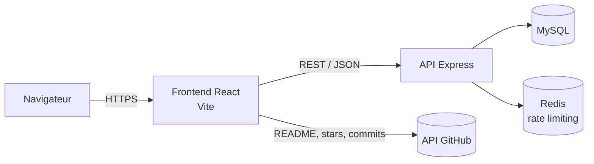

# NolhanDev — Portfolio Full-Stack

**Portfolio personnel full-stack : vitrine de mes projets, de mon parcours et de mes compétences, alimentée par une API maison.**

[](https://www.nolhandev.fr)


</div>

---

## Sommaire

- [Contexte](#contexte)
- [Fonctionnalités](#fonctionnalités)
- [Stack technique](#stack-technique)
- [Architecture](#architecture)
- [API](#api)
- [Base de données](#base-de-données)
- [Installation](#installation)
- [Variables d'environnement](#variables-denvironnement)
- [Scripts](#scripts)
- [Défis techniques](#défis-techniques)
- [Roadmap](#roadmap)
- [Licence](#licence)

---

## Contexte

La première version du portfolio était en HTML/CSS/JS vanilla. Je l'ai reconstruite entièrement en **React** pour :

- structurer le code en **composants réutilisables** ;
- afficher du **contenu dynamique** (projets, stack, statistiques) depuis une vraie base de données ;
- préparer un **espace admin** pour gérer le site sans toucher au code.

Le projet est découpé en deux applications indépendantes : un **frontend React (Vite)** et une **API REST Node.js/Express**.

---

## Fonctionnalités

- 🗂️ **Projets dynamiques** chargés depuis l'API, filtrables par type (Web / Mobile)
- 📄 **Page détail projet** avec le README GitHub rendu en Markdown (`react-markdown` + `remark-gfm`)
- ⭐ **Étoiles GitHub** récupérées en direct pour chaque projet
- 🧰 **Stack technique** classée par catégorie (Front-End, Back-End, Outils & Design)
- 📊 **Statistiques en direct** : nombre de projets, de technologies, de visites, jours en ligne, dernier commit
- 🔐 **Authentification JWT** (inscription, connexion, profil modifiable), mots de passe hashés avec bcrypt
- ✅ **Validation des données** côté serveur avec Zod
- 🚦 **Rate limiting** basé sur Redis
- 📱 **Responsive** avec menu burger sur mobile
- 📋 **Copie de l'email** en un clic avec notification

---

## Stack technique

| Côté | Technologies |
|---|---|
| **Frontend** | React 19, React Router 7, Sass (BEM), Vite 7, react-markdown |
| **Backend** | Node.js, Express 5, MySQL2, JWT, bcrypt, Zod, Redis |
| **Qualité** | ESLint, Prettier |
| **Infra** | Docker Compose (dev), Railway (prod) |

---

## Architecture

### Vue d'ensemble



### Arborescence

```
Nolhan-Portfolio/
├── Backend-Portfolio/
│   ├── docker-compose.yml        # MySQL + Redis pour le dev
│   └── src/
│       ├── server.js             # Point d'entrée, CORS, montage des routes
│       ├── infra/
│       │   ├── db.js             # Pool MySQL unique partagé
│       │   └── RedisClient.js    # Client Redis
│       ├── middlewares/
│       │   ├── auth.js                   # Vérification du JWT
│       │   ├── blockIfAuthenticated.js   # Bloque login/signup si déjà connecté
│       │   └── RateLimiting.js           # 20 requêtes / 15 min par IP et par route
│       └── routes/
│           ├── users/            # Create, Read, Update, Delete, Login
│           ├── projects/         # Create, Read, Update, Delete, Count
│           ├── stacks/           # Read, Count
│           └── analytics/        # Compteur de visites
│
└── Frontend-Portfolio/
    ├── index.html
    └── src/
        ├── main.jsx
        ├── App.jsx
        ├── assets/               # Images, CV
        └── v2/
            ├── router/           # AppRouter (React Router)
            ├── pages/            # home, apropos, services, stack, parcours,
            │                     # projects, projects_details, contact,
            │                     # login, signup, profil
            ├── components/
            │   ├── layouts/      # header, footer, carrousel, 404...
            │   ├── ui/           # bouton, cards, loader, notification...
            │   ├── Icon/         # Icônes SVG en composants
            │   ├── routing/      # PublicOnlyRoute
            │   └── analytics/    # ReloadTracker
            └── styles/
                ├── abstratcs/    # Variables, containers
                ├── components/
                ├── layouts/
                ├── pages/
                └── main.scss
```

---

## API

URL de base : `VITE_API_URL` (ex. `http://localhost:3000`)

### Authentification & utilisateurs

| Méthode | Route | Auth | Description |
|---|---|:---:|---|
| `POST` | `/users` | — | Créer un compte |
| `POST` | `/auth/login` | — | Se connecter, renvoie `{ token }` |
| `GET` | `/users/me` | 🔒 | Infos de l'utilisateur connecté |
| `PATCH` | `/users` | 🔒 | Modifier prénom, nom et/ou email |
| `DELETE` | `/users` | 🔒 | Supprimer son compte |

### Projets

| Méthode | Route | Auth | Description |
|---|---|:---:|---|
| `GET` | `/projects` | — | Liste des projets |
| `GET` | `/projects/:id` | — | Détail d'un projet |
| `GET` | `/projects/count` | — | Nombre de projets |
| `POST` | `/projects` | 🚧 | Créer un projet |
| `PUT` | `/projects` | 🚧 | Modifier un projet (par `name`) |
| `DELETE` | `/projects` | 🚧 | Supprimer un projet (par `name`) |

### Stack & analytics

| Méthode | Route | Description |
|---|---|---|
| `GET` | `/stacks` | Liste des technologies |
| `GET` | `/stacks/count` | Nombre de technologies |
| `GET` | `/reload` | Nombre total de visites |
| `POST` | `/reload` | Incrémente le compteur de visites |

> 🔒 = header `Authorization: Bearer <token>` requis · 🚧 = protection admin en cours de développement

---

## Base de données

```sql
CREATE TABLE users (
    id         INT AUTO_INCREMENT PRIMARY KEY,
    name       VARCHAR(100) NOT NULL,
    firstname  VARCHAR(100) NOT NULL,
    email      VARCHAR(255) NOT NULL UNIQUE,
    password   VARCHAR(255) NOT NULL,
    role       VARCHAR(20)  NOT NULL DEFAULT 'user'
);

CREATE TABLE projects (
    id           INT AUTO_INCREMENT PRIMARY KEY,
    name         VARCHAR(150) NOT NULL UNIQUE,
    type         ENUM('Développement Web', 'Développement Application', 'Autres') DEFAULT 'Autres',
    description  TEXT NOT NULL,
    thumbnail    VARCHAR(500),
    github_url   VARCHAR(500),
    live_url     VARCHAR(500),
    technologies JSON,
    featured     BOOLEAN DEFAULT FALSE,
    created_at   TIMESTAMP DEFAULT CURRENT_TIMESTAMP,
    updated_at   TIMESTAMP DEFAULT CURRENT_TIMESTAMP ON UPDATE CURRENT_TIMESTAMP
);

CREATE TABLE stack (
    id       INT AUTO_INCREMENT PRIMARY KEY,
    name     VARCHAR(100) NOT NULL,
    category VARCHAR(50)  NOT NULL   -- 'Front-End' | 'Back-End' | 'Outils & Design'
);

CREATE TABLE visits (
    id     INT PRIMARY KEY,
    nombre INT NOT NULL DEFAULT 0
);

INSERT INTO visits (id, nombre) VALUES (1, 0);
```

---

## Installation

### Prérequis

- Node.js 20+
- Docker (pour MySQL et Redis en local)

### 1. Cloner le projet

```bash
git clone https://github.com/MNolhan/Nolhan-Portfolio.git
cd Nolhan-Portfolio
```

### 2. Lancer MySQL et Redis

```bash
cd Backend-Portfolio
docker compose up -d
```

Crée ensuite les tables avec le script de la section [Base de données](#base-de-données).

### 3. Backend

```bash
cd Backend-Portfolio
npm install
npm run dev
```

### 4. Frontend

```bash
cd Frontend-Portfolio
npm install
npm run dev
```

Le site est alors disponible sur `http://localhost:5173`.

---

## Variables d'environnement

### `Backend-Portfolio/.env`

```env
PORT=3000

DB_HOST=localhost
DB_USER=root
DB_PASSWORD=root
DB_NAME=appdb

JWTKEY=une_cle_secrete_longue_et_aleatoire

REDIS_URL=redis://localhost:6379
```

### `Frontend-Portfolio/.env`

```env
VITE_API_URL=http://localhost:3000
```

---

## Scripts

### Backend

| Commande | Description |
|---|---|
| `npm run dev` | Lance l'API avec nodemon (rechargement auto) |
| `npm start` | Lance l'API en production |

### Frontend

| Commande | Description |
|---|---|
| `npm run dev` | Serveur de développement Vite |
| `npm run build` | Build de production |
| `npm run preview` | Prévisualise le build |
| `npm run lint` | Vérifie le code avec ESLint |
| `npm run format` | Formate le code avec Prettier |

---

## Défis techniques

- **Pool MySQL unique** : au départ, chaque route créait son propre pool de connexions, ce qui épuisait les connexions en production. Je suis passé à un pool unique partagé dans `infra/db.js`.
- **Crash SIGTERM sur Railway** : j'ai éliminé les causes une par une (variables d'environnement, configuration du pool, `type: module`) jusqu'à stabiliser le déploiement.
- **Rate limiting avec Redis** : compteur par IP et par route avec expiration automatique, pour protéger le login et le compteur de visites.
- **Intégration GitHub** : le README, les étoiles et le dernier commit de chaque projet sont récupérés directement depuis l'API GitHub, sans rien dupliquer en base.
- **Refonte v1 → v2** : nouveau design complet, avec des styles Sass organisés en BEM (abstracts / components / layouts / pages).

---

## Roadmap

- [ ] Panel admin pour gérer projets et stack depuis le site
- [ ] Middleware `requireAdmin` sur les routes d'écriture
- [ ] Contexte d'authentification React et client API centralisé
- [ ] Tests d'API (Jest + Supertest)
- [ ] CI GitHub Actions (lint + tests)

---

## Auteur

**Nolhan Marteau** — Développeur Full-Stack · Tours, France

[](https://www.nolhandev.fr)
[](https://www.linkedin.com/in/nolhan-marteau-03455a2ab/)
[](https://github.com/MNolhan)
[](mailto:mrt.nolhan@gmail.com)

---

## Licence

MIT — libre d'utilisation et de modification.
